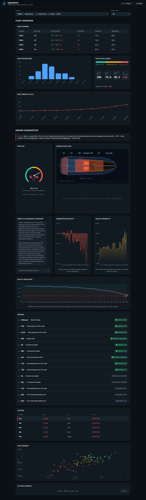
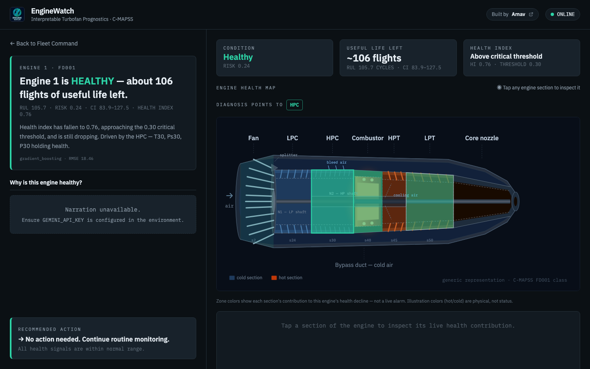
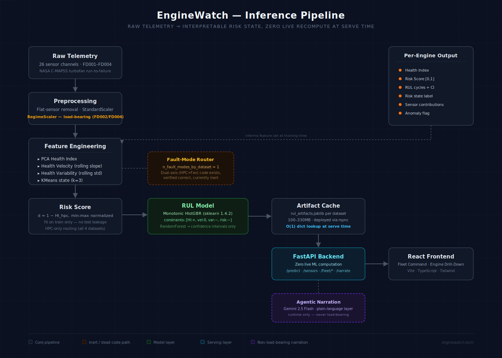

<div align="center">

# ⚙️ EngineWatch

### Interpretable Turbofan Engine Health Monitoring & RUL Prediction

[](https://enginewatch.tech)
[](https://www.python.org/)
[](https://scikit-learn.org/)
[](https://fastapi.tiangolo.com/)
[](https://react.dev/)
[]()
[]()

</div>

<br/>

## The problem

A jet engine doesn't fail without warning — it degrades. Bearings wear, seals leak, compressor efficiency drifts, and long before anything breaks, the sensor data is already telling that story. NASA's C-MAPSS dataset simulates exactly this: turbofan engines run from healthy to failure under realistic flight conditions, with 21 sensor channels recording every cycle along the way.

The hard part isn't predicting *that* an engine will fail — it's predicting *when*, and doing it in a way a maintenance engineer can actually trust and act on. A black-box model that says "47 cycles left" with no explanation is not something anyone signs off maintenance decisions against. **EngineWatch is built around that constraint first, accuracy second.**

<br/>

## The thesis

> **Interpretability over benchmark-chasing. No deep learning, ever. No SHAP.**

Every number this system produces is traceable back through a chain of feature engineering a domain expert can audit by hand — PCA-derived health index → rolling degradation trend → cluster-based state → monotonic gradient-boosted RUL. Nothing is explained *after the fact* with a post-hoc approximation; the model is interpretable *by construction*, because its constraints force health-related features to only ever push predictions in the physically correct direction.

The honest cost of that choice: **~18.5 RMSE** on FD001 vs. an estimated ~13 achievable with an LSTM. That gap is the price of a fully traceable inference chain, and it's a deliberate trade, not a limitation the project ran into by accident. The acceptance criterion this project actually optimizes for is **risk–RUL Spearman correlation**, not RMSE or the NASA scoring function — because a system that ranks engines correctly by urgency is more useful to a maintenance planner than one that's marginally more accurate on average and unexplainable.

This also means the system knows its own boundaries. C-MAPSS models a 2-spool turbofan (GE90/PW4090-class); a 3-spool Rolls-Royce Trent architecture is explicitly out of scope, because the intermediate-pressure shaft isn't represented in this data — the system doesn't claim generality it can't back up.

<br/>

## See it live

**[enginewatch.tech](https://enginewatch.tech)**

<div align="center">

<br/><sub><em>Fleet Command — fleet-at-a-glance risk ranking across all monitored engines</em></sub>
</div>

<br/>

<div align="center">

<br/><sub><em>Engine Drill-Down — plain-language narration alongside the full interpretability trail for a single engine</em></sub>
</div>

> *(Screenshots captured live from enginewatch.tech.)*

<br/>

## What it produces, per engine

| Output | What it means |
|---|---|
| **Health Index** | PCA-derived degradation signal, healthy → critical |
| **Health Velocity** | Rate of decline per cycle — is it getting worse, and how fast |
| **Health Variability** | Instability signal that tends to precede failure |
| **Cluster state** | Healthy / Degrading / Critical, via KMeans (k=3) |
| **Risk Score** | Normalized [0,1] distance metric, fit on train data only |
| **RUL Prediction** | Remaining useful life in cycles, with a confidence interval |
| **Sensor contributions** | Which of the 21 sensors are actually driving the score |
| **Anomaly flag** | Whether this engine looks like anything the model has seen before |
| **Plain-language narration** | The same output, explained in a sentence a non-specialist can read |

At the fleet level: cross-engine risk ranking, trend analytics, and shift-handover summaries — so the question isn't just "how is this one engine doing" but "which five engines does the maintenance team need to look at this week."

### Level 2: Engine Drill-Down

The shipped Level 2 engine drill-down view provides:
- **A comprehension layer**: a verdict headline that leads with status (e.g. "Engine 34 is CRITICAL — likely to fail in about 4 flights"), framed "Why is this critical?" narration, and a pinned action-closure line (e.g. "→ Schedule inspection within ~4 flights").
- **Interactive cutaway affordances** on the engine visualization (click-to-select rather than hover, with a Clear button).
- **Level 1 EngineSelector + clickable AnomalyScatter**, making the drill-down reachable for all engines, not just Critical ones.
- **Strict semantic color system**: red = risk only, amber = caution only, green = healthy only, one neutral accent for everything else.
- **Depth-only tooltips**: tooltips are never load-bearing for understanding the page.

<br/>

## Architecture

<div align="center">

</div>

**Fault-mode routing** currently runs HPC-only across all four datasets (`n_fault_modes_by_dataset: 1`). The dual-axis (HPC + Fan-degradation) code path exists in the repo, is architecturally correct, and is currently inert by design — an empirical investigation confirmed the fan-degradation axis is genuinely non-predictive for FD003/FD004 (Spearman 0.032 / 0.114) even after fixing two latent bugs uncovered during that work. Reactivating it is a real, not-yet-made decision, not an oversight.

**Regime normalization** (`RegimeScaler`) is load-bearing for FD002 and FD004, which each have 6 distinct operating regimes; it degenerates gracefully to a single regime for FD001/FD003.

**Every API response is served from a pre-computed artifact cache** — `models/{dataset_id}/rul_artifacts.joblib` — so there is zero live ML computation at request time. The pipeline above runs at training/cache-build time, not at serve time.

<br/>

## Results — canonical metric table

Verified against `config/canonical_gate.json`, the single source of truth this repo's CI checks against on a schedule.

| Dataset | Model | RMSE | NASA Score | Risk–RUL Spearman |
|---|---|---|---|---|
| FD001 | HistGBR (monotonic) | 18.459 | 617.5 | **−0.750** |
| FD002* | HistGBR (monotonic) | 31.125 | 13,635 | **−0.765** |
| FD003 | HistGBR (monotonic) | 22.798 | 1,995.7 | **−0.816** |
| FD004 | HistGBR (monotonic) | 34.410 | 53,028 | **−0.736** |

*\* FD002 spans six operating regimes rather than one. This blurs the boundaries between degradation states more than in the single-regime datasets (FD001/FD003), producing a clustering silhouette score of 0.284 — below our 0.30 threshold. This is a disclosed limitation of the multi-regime setting, not a defect in the pipeline; risk-RUL Spearman correlation (−0.765) remains the primary, unaffected acceptance criterion.*

FD002 and FD004 are the harder datasets here, and the README says so on purpose — FD002's clustering silhouette (0.284) sits below the 0.30 target, disclosed as a known limitation rather than smoothed over. A system that only reports its best numbers isn't actually interpretable, it's just quieter about the parts that don't work as well.

**Canonical regression gate** — Engine 34 / FD001, re-checked automatically on every deploy:
```
risk_score:    0.7402876566726511
rul_cycles:    3.698652753342952
health_index:  0.2597123433273489
risk_state:    Critical
rmse:          18.459221643626265
```

<br/>

## How this was engineered

Solo build, end to end — ML pipeline, FastAPI backend, React/TypeScript frontend, and cloud deployment, all designed and shipped by one person. Getting there involved coordinating multiple AI coding tools without letting any of them quietly drift from the architecture, which turned into its own piece of engineering discipline worth documenting.

**The split:**

| Tool | Role |
|---|---|
| **Claude** | Architecture, correctness sign-off, and brief-writing — ~90% of the reasoning work |
| **Antigravity** (Google) | Executes structured briefs for backend/ML/deploy and frontend work |
| **Claude Code** | Reasoning-heavy or cross-cutting execution from the terminal |
| **Claude Cowork** | Narrow, pre-scoped, report-only overnight/batch tasks |
| **GitHub Copilot** | Inline mechanical work only — renames, lint, boilerplate |
| **Gemini 2.5 Flash** | Runtime narration only — never load-bearing for correctness |

The governing rule across all of it: **a tool's own summary of what it did is a claim to verify, not a fact to accept.** Every non-trivial change gets checked against a real diff, a real `curl` response, or a real terminal output before it's trusted — a discipline that has caught real regressions in this project, including silent test-data leakage in a fallback branch, a droplet silently running an unversioned build behind a correct-looking API response, and an unscoped glob delete that took out 11 tracked files along with the scratch files it was meant to remove.

That discipline is written down, not just remembered — `AGENTS.md` at the repo root is the shared contract every agent reads, backed by an automated CI layer (`ci-static.yml` on every PR, `ci-live-gate.yml` hitting production every 6 hours, `/api/version` turning "is the server running what I think" into a `curl` instead of an SSH session) and a set of regression test prompts, each one written after a real incident, re-run cold after any change to the contract itself.

<br/>

## Environment

Model artifacts are version-sensitive — train and serve inside the same environment or the joblib files won't load correctly.

```bash
source ../.venvs/project-2/bin/activate   # venv lives one directory above the repo root

which python                               # always verify before trusting any measurement
pip show scikit-learn numpy joblib
```

Pinned: **Python 3.12 · scikit-learn 1.4.2 · numpy 1.26.4 · joblib 1.4.2**

<br/>

## Project structure

```text
data/           load.py, preprocess.py, regime.py (RegimeScaler)
features/       health_index.py, velocity.py, variability.py
model/          clustering.py, risk.py, rul.py, fault_classifier.py
evaluation/     validation.py
app/            FastAPI backend, endpoint routers
frontend/       React / Vite / TypeScript — Fleet Command, Engine Drill-Down
config/         config.yaml, canonical_gate.json
scripts/        deployment + data pipeline utilities
.agents/        skills/, test-prompts.md
AGENTS.md       shared multi-agent operating contract
DEPLOY.md       authoritative manual deployment process
```

<br/>

## Dataset

NASA C-MAPSS FD001–FD004 — turbofan run-to-failure simulation data across single- and multi-operating-condition scenarios.

> A. Saxena, K. Goebel, D. Simon, N. Eklund, *"Damage Propagation Modeling for Aircraft Engine Run-to-Failure Simulation,"* PHM 2008.

<br/>

## Status

**v3.0** — deployed, all four datasets live, fleet analytics shipped, full CI automation, formal multi-agent coordination contract.

- ✅ FD001–FD004 pipeline live at [enginewatch.tech](https://enginewatch.tech), zero live recompute
- ✅ Fleet-level analytics and agentic narration
- ✅ CI automation (`ci-static.yml`, `ci-live-gate.yml`, `/api/version`)
- ✅ Fleet Command (Level 1 frontend) shipped
- ✅ Engine Drill-Down split-screen (Level 2) — shipped and live
- ⚪ AeroGraph — aviation knowledge-graph platform bridging this project with flight-logistics data — blueprint stage, gated on stability, not a committed date

<sub>Full incident history, dead-number list, and hard architectural constraints live in `AGENTS.md`.</sub>

</div>
